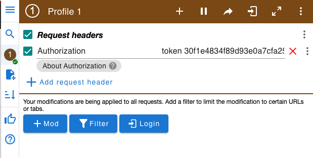

# Tier Shorter API
The application is written using Django REST API framework. It use some functionalities to ensure restricted data access to user data. The application use Authorization Token to limit the functionalities to Update, Create and Delete records only to the user that has created the short URL. A public API allow all the user to transform the short URL into the original long URL while do not allow to list all the registered records. 

The application use an **authentication token** to enable access to the creation of short URL. Each user can only list and modify **their own** data, data registered by other user will not be shown.

A public API (/tier.app) enable public (anonymous) access to the data by showing only the long url connected to the shor url passed as argument e.g. (/tier.app/12). The public API **do not allow to list all** the registered records

## Install
To install the service create a directory and create a virtual environment:
    mkdir tier
    cd tier
    python -m venv ./venv

once the virtual environment is created activate it and install the required packages
    source venv/bin/activate
    pip install -r requirements.txt

## Run the server 
To run the server you need to activate the venv, so be sure that your prompt has a (venv) at the beginning, in case you need to activate it use this command source venv/bin/activate.

to start the server execute 
    python manage.py runserver 0.0.0.0:8000 
    
once the server is running open the page http://localhost:8000/login 
and authenticate with one of the registered user listed at the end of this document

## Routes
There are 4 routes in total:
* **/admin** enter the administration page to navigate/create users and data
* **/login** authenticate user and return the token to be used to access restricted area
* **/short** create a short url and retrieve Statistics, data are filtered only URL generated by the user will be shown
* **/tier.app/<short id>** transform short id into the original URl

### login route  
the route /login open a page asking for user and password to authenticate users and provide a token to be added to the headers of all the request going to /short route to create, update and delete long URL into short id.

### short route
Take in mind in order to be able to access this API the browser need to send a header with the **token** provided by the login API once the user is authenticated. In order to do that use a plugin or postman tool. I have used a chrome plugin https://modheader.com/docs/modheader. When modheader is installed click on '+ Add request header' and set as key 'Authorization' and as value 'token <your token>', remenber to add the 'token ' string before the token value.
Enable it checking the box, and you should be able to access /short API.   

### tier.app route
this route is public, and it provides the transformation functionality from a short url /tier.app/<id> into the orginal long url. Each time it is called the filed **'hits'** of the selected record in increased by one, the owner of the record can therefore check the amount of its short url access by reading its own URLs set opening the /short API   

### admin route
admin is the administration route manage by Django, you can open it in the browser and navigate the records and create new user.

## Users
two user have been registered with some URL example.
user paolo:paolo has admin privileges, 
user tier:TIER2023 is a normal user 

